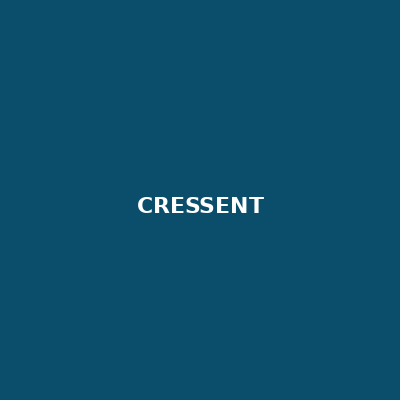

## CRESSENT {#cressent}

::: {.grid}
::: {.g-col-12 .g-col-md-3}
{fig-alt="CRESSENT logo placeholder"}
:::
::: {.g-col-12 .g-col-md-9}
**Purpose:** Modular toolkit for annotation and analysis of CRESS (circular Rep-encoding ssDNA) DNA viruses — motif detection, recombination analysis, stem-loop/iteron detection, sequence logos.

**My role:** Lead developer — design, implementation, testing, documentation, packaging, and manuscript.

**Languages:** Python, R

**Status:** `Active` — published and maintained

**Documentation:** [GitHub repository](https://github.com/ricrocha82/cressent)

**Repository:** [github.com/ricrocha82/cressent](https://github.com/ricrocha82/cressent)

**Installation:** PyPI and Bioconda *(add exact install commands here once confirmed, e.g. `pip install cressent` / `conda install -c bioconda cressent`)*

**Citation:**
> Pavan, R.R., Sullivan, M.B. and Tisza, M., 2026. CRESSENT: a bioinformatics toolkit to explore and improve ssDNA virus annotation. *Microbial Genomics*, 12:001632. [https://doi.org/10.1099/mgen.0.001632](https://doi.org/10.1099/mgen.0.001632)

**License:** *[PLACEHOLDER — confirm license, e.g. MIT/GPL-3.0]*

**Tests:** Automated test suite (see repository)

**Releases:** See [GitHub releases](https://github.com/ricrocha82/cressent/releases)

**Related publication:** [Microbial Genomics, 2026](https://doi.org/10.1099/mgen.0.001632)

```{mermaid}
flowchart LR
  A[CRESS virus genome] --> B[CRESSENT CLI]
  B --> C[Motif / structural annotation]
  B --> D[Recombination analysis]
  C --> E[Sequence logos + report]
  D --> E
```
:::
:::

---

## VirION3

**Purpose:** Hybrid long- and short-read viromics workflow (Nanopore, PacBio, Illumina) for improved viral genome recovery.

**My role:** Developer, benchmarking analysis.

**Languages:** Nextflow, Bash, Python

**Status:** `In development`

**Repository:** *link pending public release*

**Related project page:** [VirION3](../projects/virion3.qmd)

---

::: {.placeholder-note}
**To add software:** copy `software/_template.qmd`, fill in the details, and link it from this page.
:::
